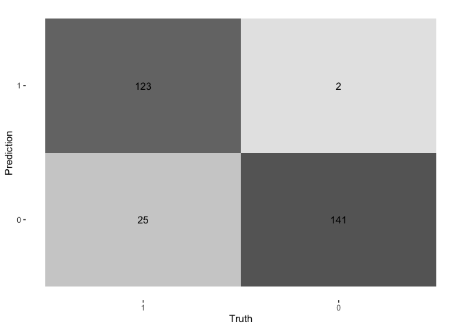

\    
“Have you gone insane? How come to earth you were doing the a Casino?!" My sweet dream was interrupt by the call (in fact yelling) of my mother. Of course I did not spent 10,000 yuan in a casino--it was credit card fraud.   
Studies shows nearly half of the adult population in America (127 million) has suffered a fraudulent transaction using one of their credit or debit cards. Especially in card use overseas, credit card information is easily attainable as time differentiates in the banking systems. Although most banks usually discharge the cardholder, the money are not refunded in many cases. So, how can we use our acknowledge from PSTAT231 to research and analysis this real world problem?  

```r
knitr::include_graphics("/Users/Yuer_Hao/Desktop/PSTAT231-Final-Project/Picture/Cover.jpg")
```


## 1. Introduction
#### 1.1 The purpose of this project 
Every year, fraudulent transactions with credit cards result in billions of dollars in losses. The key to minimizing these losses is the development of effective fraud detection algorithms, and increasingly, these algorithms depend on cutting-edge machine learning methods to help fraud investigators. Nevertheless, because of the non-stationary distributions of the data, the extremely unbalanced classification distributions, and the ongoing streams of transactions, designing fraud detection algorithms is especially difficult. Due to confidentiality concerns, publicly available information are also hard to come by, leaving many questions regarding how to approach this problem in the dark.  

#### 1.2 Some facts you need to know about Credit Card Fraud  

- A total of 127 million adults in America—or nearly half of the population—have experienced a fraudulent transaction on one of their credit or debit cards. Card fraud has happened more than once to more than one in three people who use credit or debit cards.

- On American credit and debit cards, the typical charge was $62, which translates to around 8 billion in attempted fraudulent transactions. Only around 40% of cardholders have email or text notifications from their bank or credit card issuer activated.

- Only 19% of victims with alerts turned on had to take further action to reverse fraudulent charges, compared to about 81 percent of victims without these warnings.


```r
library(vembedr)
embed_youtube("c-DxF1XVATw")
```

```{=html}
<div class="vembedr">
<div>
<iframe src="https://www.youtube.com/embed/c-DxF1XVATw" width="533" height="300" frameborder="0" allowfullscreen="" data-external="1"></iframe>
</div>
</div>
```

```r
embed_youtube("2xBddrmbG7w")
```

```{=html}
<div class="vembedr">
<div>
<iframe src="https://www.youtube.com/embed/2xBddrmbG7w" width="533" height="300" frameborder="0" allowfullscreen="" data-external="1"></iframe>
</div>
</div>
```
#### 1.3 Why might this model be useful?
In order to find fraud tendencies, credit card fraud detection (CCFD) must analyze vast amounts of transaction data. Human investigators are unable to effectively solve this issue due to the vast amounts of data and fraudsters' constantly changing tactics. In the past ten years, machine learning (ML) methods, which enable searching and pattern detection from vast volumes of data, have become an increasingly important addition to CCFD. It has been demonstrated that ML algorithms may considerably increase the effectiveness of fraud detection systems and help fraud investigators spot fraudulent transactions.  

The model with the highest predicted fraud detection performances on the following block of transactions is the optimal model for a fraud detection system. Utilizing past credit card transactions data, we attempted to estimate and predict future fraudulent transactions. As a result, if the movement in fraud can be forecasted, it would assist help fraud investigators better proposing policies to our real world regulation.

## 2. Dataset Overview
This project uses MACHINE LEARNING GROUP - ULB's dataset from [Kaggle](<https://www.kaggle.com/datasets/mlg-ulb/creditcardfraud>)  

The dataset contains credit card transactions done by European cardholders in September 2013.
This dataset presents transactions that occurred in two days, where we have 492 frauds out of 284,807 transactions. The dataset is quite unbalanced, with frauds making up 0.172% of all transactions in the positive class (frauds) account.    
There are 284807 observations and 31 columns in this dataset. There are 1 response variable and 30 predictor variables. Additionally, 30 of them are numerical, while 1 is binary. The response variable, "Class," has a value of 1 in cases of fraud and 0 in all other cases.

- `Time`: (Data Type: continuous) Number of seconds elapsed between this transaction and the first transaction in the dataset  

- `V1-V28`: (Data Type: continuous) May be result of a PCA Dimensionality reduction to protect user identities and sensitive features  

- `Amount`: (Data Type: continuous) Transaction Amount  

- `Class`: (Data Type: nominal) The response variable has a value of 1 when there is fraud and 0 when there isn't.  
*Note: a full copy of the codebook is available in zipped final projecct files.*

### 2.1 Loading Data and Packages


```r
#read, explore, check nulls, distributions
raw_data <- read.csv("/Users/Yuer_Hao/Desktop/PSTAT231 Final Project/data/creditcard.csv")
head(raw_data)
```

```
##   Time         V1          V2        V3         V4          V5          V6
## 1    0 -1.3598071 -0.07278117 2.5363467  1.3781552 -0.33832077  0.46238778
## 2    0  1.1918571  0.26615071 0.1664801  0.4481541  0.06001765 -0.08236081
## 3    1 -1.3583541 -1.34016307 1.7732093  0.3797796 -0.50319813  1.80049938
## 4    1 -0.9662717 -0.18522601 1.7929933 -0.8632913 -0.01030888  1.24720317
## 5    2 -1.1582331  0.87773675 1.5487178  0.4030339 -0.40719338  0.09592146
## 6    2 -0.4259659  0.96052304 1.1411093 -0.1682521  0.42098688 -0.02972755
##            V7          V8         V9         V10        V11         V12
## 1  0.23959855  0.09869790  0.3637870  0.09079417 -0.5515995 -0.61780086
## 2 -0.07880298  0.08510165 -0.2554251 -0.16697441  1.6127267  1.06523531
## 3  0.79146096  0.24767579 -1.5146543  0.20764287  0.6245015  0.06608369
## 4  0.23760894  0.37743587 -1.3870241 -0.05495192 -0.2264873  0.17822823
## 5  0.59294075 -0.27053268  0.8177393  0.75307443 -0.8228429  0.53819555
## 6  0.47620095  0.26031433 -0.5686714 -0.37140720  1.3412620  0.35989384
##          V13        V14        V15        V16         V17         V18
## 1 -0.9913898 -0.3111694  1.4681770 -0.4704005  0.20797124  0.02579058
## 2  0.4890950 -0.1437723  0.6355581  0.4639170 -0.11480466 -0.18336127
## 3  0.7172927 -0.1659459  2.3458649 -2.8900832  1.10996938 -0.12135931
## 4  0.5077569 -0.2879237 -0.6314181 -1.0596472 -0.68409279  1.96577500
## 5  1.3458516 -1.1196698  0.1751211 -0.4514492 -0.23703324 -0.03819479
## 6 -0.3580907 -0.1371337  0.5176168  0.4017259 -0.05813282  0.06865315
##           V19         V20          V21          V22         V23         V24
## 1  0.40399296  0.25141210 -0.018306778  0.277837576 -0.11047391  0.06692807
## 2 -0.14578304 -0.06908314 -0.225775248 -0.638671953  0.10128802 -0.33984648
## 3 -2.26185710  0.52497973  0.247998153  0.771679402  0.90941226 -0.68928096
## 4 -1.23262197 -0.20803778 -0.108300452  0.005273597 -0.19032052 -1.17557533
## 5  0.80348692  0.40854236 -0.009430697  0.798278495 -0.13745808  0.14126698
## 6 -0.03319379  0.08496767 -0.208253515 -0.559824796 -0.02639767 -0.37142658
##          V25        V26          V27         V28 Amount Class
## 1  0.1285394 -0.1891148  0.133558377 -0.02105305 149.62     0
## 2  0.1671704  0.1258945 -0.008983099  0.01472417   2.69     0
## 3 -0.3276418 -0.1390966 -0.055352794 -0.05975184 378.66     0
## 4  0.6473760 -0.2219288  0.062722849  0.06145763 123.50     0
## 5 -0.2060096  0.5022922  0.219422230  0.21515315  69.99     0
## 6 -0.2327938  0.1059148  0.253844225  0.08108026   3.67     0
```

```r
skim(raw_data)%>%
dplyr:: select(skim_type, skim_variable, n_missing, numeric.mean, numeric.hist)
```


Table: Data summary

|                         |         |
|:------------------------|:--------|
|Name                     |raw_data |
|Number of rows           |284807   |
|Number of columns        |31       |
|_______________________  |         |
|Column type frequency:   |         |
|numeric                  |31       |
|________________________ |         |
|Group variables          |None     |


**Variable type: numeric**

|skim_variable | n_missing|     mean|hist  |
|:-------------|---------:|--------:|:-----|
|Time          |         0| 94813.86|▃▇▅▆▇ |
|V1            |         0|     0.00|▁▁▁▁▇ |
|V2            |         0|     0.00|▁▁▁▇▁ |
|V3            |         0|     0.00|▁▁▁▁▇ |
|V4            |         0|     0.00|▂▇▁▁▁ |
|V5            |         0|     0.00|▁▁▁▇▁ |
|V6            |         0|     0.00|▁▇▁▁▁ |
|V7            |         0|     0.00|▁▇▁▁▁ |
|V8            |         0|     0.00|▁▁▁▇▁ |
|V9            |         0|     0.00|▁▁▇▁▁ |
|V10           |         0|     0.00|▁▁▇▁▁ |
|V11           |         0|     0.00|▁▇▁▁▁ |
|V12           |         0|     0.00|▁▁▁▇▁ |
|V13           |         0|     0.00|▁▃▇▁▁ |
|V14           |         0|     0.00|▁▁▁▇▁ |
|V15           |         0|     0.00|▁▇▂▁▁ |
|V16           |         0|     0.00|▁▁▇▁▁ |
|V17           |         0|     0.00|▁▁▁▇▁ |
|V18           |         0|     0.00|▁▁▂▇▁ |
|V19           |         0|     0.00|▁▁▇▂▁ |
|V20           |         0|     0.00|▁▁▇▁▁ |
|V21           |         0|     0.00|▁▁▇▁▁ |
|V22           |         0|     0.00|▁▁▇▁▁ |
|V23           |         0|     0.00|▁▁▁▇▁ |
|V24           |         0|     0.00|▁▇▆▁▁ |
|V25           |         0|     0.00|▁▁▇▂▁ |
|V26           |         0|     0.00|▁▆▇▁▁ |
|V27           |         0|     0.00|▁▁▇▁▁ |
|V28           |         0|     0.00|▁▇▁▁▁ |
|Amount        |         0|    88.35|▇▁▁▁▁ |
|Class         |         0|     0.00|▇▁▁▁▁ |
## 3. Data Cleaning  
While the data set that was downloaded was tidy, a few different cleaning steps were necessary before the split occurred: 

### 3.1 Clean name 

```{.r .fold-show}
raw_creditc <- raw_data %>% 
  clean_names()
```
### 3.2 Deal with imbalanced problems  
Let's now determine whether or not our response variable `class` is balanced. If not, we must resolve the situation.  

```{.r .fold-show}
table(raw_creditc$class)
```

```
## 
##      0      1 
## 284315    492
```
We can tell our response variable `class` is highly unbalanced. Observations on "0" class are far more frequent than "1" class. We need to use some functions to address this problem, otherwise this will have a significant impact on our prediction models. The TA suggests that we employ the sampling technique ovun.sample() function to processing it.

```r
creditc<- ovun.sample(class~.,data = raw_creditc,
                             p=0.5,seed = 1,method = "under")$data
```


```{.r .fold-show}
table(creditc$class)
```

```
## 
##   0   1 
## 474 492
```
our response variable is almost balanced.   

### 3.3 Convert class to factor

```{.r .fold-show}
creditc <- creditc %>%
  mutate(class = factor(class, levels = c("1", "0"))) 
```

### 3.4 Summary 

```{.r .fold-show}
summary(creditc$amount)
```

```
##    Min. 1st Qu.  Median    Mean 3rd Qu.    Max. 
##    0.00    1.29   17.53  110.80   99.99 3889.00
```

```{.r .fold-show}
var(creditc$amount)
```

```
## [1] 79239.91
```

```{.r .fold-show}
# show how many observations and variables in the new dataset
dim(creditc) 
```

```
## [1] 966  31
```


### 3.5 Clean name


```{.r .fold-show}
creditc$amount <- scale(creditc$amount)
head(creditc)
```

```
##     time        v1         v2         v3         v4          v5         v6
## 1 115330  1.948495 -2.4328242 -1.2169303 -2.4530214  0.09082679  4.2203172
## 2  97565  1.948707 -0.3391218 -1.1546341  0.3158238  0.05294384 -0.3824387
## 3 146840 -1.057784  1.9237784 -2.7290233  0.1277136  3.20514632  3.8164145
## 4 166797  1.881484 -0.3834949 -0.1647898  0.4635760 -0.88000644 -1.0167097
## 5  44774 -3.907550 -2.9204593  0.1326738  4.0886801  2.37190176 -0.7836577
## 6 151254  1.925416  0.5361020 -0.9851712  3.4202293  1.00790735  0.8207051
##            v7         v8         v9         v10         v11         v12
## 1 -2.53435629  1.1362694 -0.5960961  1.44381915 -0.32070338 -0.68661365
## 2 -0.09716884 -0.2274915  2.1491916 -0.43094995  1.22054027 -1.25835557
## 3 -0.64081125 -1.3739571 -1.2845466 -1.29969929 -0.16352126 -0.00419732
## 4 -0.28491272 -0.2206464  0.8159585 -0.05637091 -0.19202761  1.16516206
## 5 -0.87404625 -3.0750082 -1.0801413  0.82482066 -0.99749955  0.38588516
## 6  0.12124421  0.1533321 -1.1814624  1.59252107 -0.03725105  0.23320675
##          v13         v14         v15         v16          v17        v18
## 1  0.6358285 -0.82113376  0.89893329  0.09423038  0.068265414  0.5573523
## 2  1.8643940  1.59625369 -1.87460480 -0.35818920  0.246080193  0.4489676
## 3 -0.7011774 -0.09235227  0.09799396 -0.44779961  1.519808132  0.3427721
## 4  1.2091746 -0.24966393  0.36126522  0.23841666 -0.407593659 -0.7771290
## 5  1.1415790  0.12490179  0.36735428 -0.18305190  0.006499662 -0.1162191
## 6 -0.1532594  0.45743574 -1.42886978  1.13799876 -1.163919739 -0.1460211
##          v19         v20         v21        v22         v23         v24
## 1 -0.7499656 -0.05966340  0.14479793  0.5715729  0.19591337  0.70263854
## 2  0.5207497 -0.14488231 -0.01757742  0.4046979 -0.07109144 -0.47944447
## 3  0.3092393  0.68333667 -1.19656940  0.6727016 -0.04016785  0.57270376
## 4 -0.2185803 -0.03205528 -0.19212958 -0.5048663  0.43783263  0.48215724
## 5  1.2106120  0.43153187 -1.53995168  0.8945958  1.38531492 -0.02604194
## 6 -0.8563276 -0.25214395 -0.26540584 -0.8351840  0.30784382 -0.05682810
##           v25         v26         v27          v28     amount class
## 1 -0.54009091 -0.08365089  0.07641251 -0.009086192  0.1268249     0
## 2  0.20429913  0.15962962 -0.06419000 -0.074708708 -0.2060397     0
## 3  0.02569644 -0.37054060  0.33862279  0.215431992 -0.3250468     0
## 4 -0.68266256  0.19525195 -0.04039997 -0.028229323 -0.1913326     0
## 5 -0.14995883  0.27862889  0.97432304 -0.309421848  0.9046338     0
## 6 -0.20409834 -0.35081119 -0.04464170 -0.053214199 -0.3686354     0
```

```{.r .fold-show}
#save processed dataframe
#write.csv(creditc, "/Users/Yuer_Hao/Desktop/PSTAT231-Final-Project/data/processed/creditc.csv", row.names=FALSE)
```
We completed the the process of data cleaning.

## 4. Data Split

The data was stratified sampling by *class* , and spitted to 70% training set and 30% testing set.


```{.r .fold-show}
set.seed(2022)
creditc_split <- initial_split(creditc, prop = 0.70, strata = class)
# Training Dataset
creditc_train <- training(creditc_split)
# Testing Dataset
creditc_test <- testing(creditc_split)

# check dimension
dim(creditc_train)
```

```
## [1] 675  31
```

```{.r .fold-show}
dim(creditc_test)
```

```
## [1] 291  31
```

- The training data has 675 observations.  
- The testing data has 291 observations.

## 5. Data Exploration

### 5.1 Bar Plot and Table  
\
After employing the ovun.sample() function to processing the data, we can see that the number of card fraud is balanced from the table and plot.


```{.r .fold-show}
table(creditc_train$class)
```

```
## 
##   1   0 
## 344 331
```


```r
creditc_train %>% 
  ggplot(aes(x = class,fill=class)) +
  geom_bar() +
  ggtitle("Count of Fraud") +
  labs(y = "Count", x = "Transaction Type") +
  scale_fill_brewer(labels = c("Count of fraud", "Count of Other Transaction"))
```

<div class="figure" style="text-align: center">

<p class="caption">The Count of Fraud in the Training Dataset</p>
</div>


### 5.2 Correlation Matrix  
Since the majority of the variables were subjected to a Principal Component Analysis (PCA) algorithm, we have seen that they are not all correlated. As a result, we are uncertain if the relevance of the Principal Components is reflected in the order in which the variables are numbered.  


```r
creditc_train %>% 
  select(is.numeric) %>% 
  cor(use = "complete.obs") %>% 
  corrplot(method = "color",
           type = "full", 
           addCoef.col = "black", 
           order = "hclust", 
           tl.cex = 0.45,
           number.cex = 0.35)
```

<div class="figure" style="text-align: center">

<p class="caption">The Correlation Matrix of the Training Dataset</p>
</div>
As we would anticipate following the feature transformation, there are relatively few associated variables visible from the correlation matrix shown. Time and Amount, the two significant aspects, exhibit some relative connection with some variables. It would be difficult to conclusively suggest a link between any of them given their low levels. Additionally, it suggests that the likelihood of any linearity in our dataset would be quite minimal.

### 5.3 Target Variable Data Transformation and Analysis
Given their transformation and standardization, we have no information of the numerical predictors for confidentiality, with the exception of Amount & Time. Amount therefore emerged as maybe the most illuminating for the feature variable analysis. We have to log-scale the variable in order to better comprehend its distribution.

```r
## Target Variable `amount` Analysis
creditc_train$amount %>% summary()
```

```
##        V1           
##  Min.   :-0.393609  
##  1st Qu.:-0.390057  
##  Median :-0.334994  
##  Mean   :-0.004777  
##  3rd Qu.:-0.038400  
##  Max.   :10.971425
```

```r
creditc_train %>% ggplot(aes(amount)) +
  geom_histogram(bins=30) +
  scale_x_log10() +
  labs(
  x = "Dollar Amount (Log Scale)", y = "Frequency (Count)",
  title= "Distribution of Transaction Amount (Log Scaled)"
 )
```

```
## Warning in self$trans$transform(x): NaNs produced
```

```
## Warning: Transformation introduced infinite values in continuous x-axis
```

```
## Warning: Removed 526 rows containing non-finite values (`stat_bin()`).
```

<div class="figure" style="text-align: center">

<p class="caption">Target Variable `amount` Analysis</p>
</div>
There will be minimal probability for any outliers among the data values for V1, V2,..., V28 since the majority of predictors have been modified. Therefore, as Amount is the only useful numerical attribute, we shall just look at it.


```r
creditc_train %>% ggplot(aes(x=amount)) +
  geom_boxplot() +
  labs(x = "Amount ($USD)", title= "Distribution of Transaction Amount")
```

<div class="figure" style="text-align: center">

<p class="caption">Distribution of Transaction Amount</p>
</div>
We can see a significant number of outliers on the higher end of the distribution from the boxplot above. It would signify transactions involving large amounts of money in thousands. When developing the predictive models, we would consider how this skewed distribution might affect data transformation or the choice of models that are resistant to such feature types.    

In order to analysis the variable time, we will examine transaction time to look for any abnormalities. We will create a scatterplot using only the fraud dataset.


```r
## Target Variable `time` Analysis
## Are there any tendency in time where fraud occurred?
# Splitting data by fraud class
CC_no_fraud <- creditc_train %>% filter(class == 0)
CC_fraud <- creditc_train %>% filter(class == 1)
# Scatterplot

CC_fraud %>% ggplot(aes(x=time, y=amount)) +
  geom_point() +
  labs(
  y = "Amount ($)", 
  x = "Time (s)",
  title= "Fraudulent Transactions Across Time"
 )
```

<div class="figure" style="text-align: center">

<p class="caption">Target Variable `time` Analysis</p>
</div>
There doesn't seem to be a clustering structure on a timespan in the graph above. Therefore, we would suppose that fraud happened relatively randomly throughout time.  


## 6.Model fitting  

The goal of model selection is to choose the model that will produce the best predictions on upcoming data. The model with the highest predicted fraud detection performances on the following block of transactions is the optimal model for a fraud detection system.

### 6.1 Create Recipe


```{.r .fold-show}
creditc_recipe <- recipe(class ~ ., creditc_train) %>% 
  step_dummy(all_nominal_predictors()) %>% 
  step_normalize(all_predictors())
```

## Model 1: Logistic Regression, LDA/QDA

For Model 1, I will fitting 3 different models and find the best one with highest accuracy.

### M1.1a) Logistic Regression


```{.r .fold-show}
# classification using the *glm* engine.
log_reg <- logistic_reg() %>% 
  set_engine("glm") %>% 
  set_mode("classification")

log_wkflow <- workflow() %>% 
  add_model(log_reg) %>% 
  add_recipe(creditc_recipe)

log_fit <- fit(log_wkflow, creditc_train)
```

```
## Warning: glm.fit: fitted probabilities numerically 0 or 1 occurred
```

### M1.1b) LDA - Linear Discriminant Analysis


```{.r .fold-show}
# classification using the *MASS* engine
lda_mod <- discrim_linear() %>% 
  set_mode("classification") %>% 
  set_engine("MASS")

lda_wkflow <- workflow() %>% 
  add_model(lda_mod) %>% 
  add_recipe(creditc_recipe)

lda_fit <- fit(lda_wkflow, creditc_train)
```

### M1.1c) QDA - Quadratic Discriminant Analysis


```{.r .fold-show}
# classification using the *MASS* engine
qda_mod <- discrim_quad() %>% 
  set_mode("classification") %>% 
  set_engine("MASS")

qda_wkflow <- workflow() %>% 
  add_model(qda_mod) %>% 
  add_recipe(creditc_recipe)

qda_fit <- fit(qda_wkflow, creditc_train)
```

### M1.2 Comparing three models


```r
log_acc <- predict(log_fit, 
                   new_data = creditc_train, 
                   type = "class") %>% 
  bind_cols(creditc_train %>% select(class)) %>% 
  accuracy(truth = class, estimate = .pred_class)

lda_acc <- predict(lda_fit, 
                   new_data = creditc_train, 
                   type = "class") %>% 
  bind_cols(creditc_train %>% select(class)) %>% 
  accuracy(truth = class, estimate = .pred_class)

qda_acc <- predict(qda_fit, 
                   new_data = creditc_train, 
                   type = "class") %>% 
  bind_cols(creditc_train %>% select(class)) %>% 
  accuracy(truth = class, estimate = .pred_class)

result_tab <- bind_rows(log_acc, lda_acc, qda_acc) %>% 
  tibble() %>% mutate(model = c("Logistic", "LDA", "QDA")) %>% 
  select(model, .estimate) %>% 
  arrange(-.estimate)

result_tab
```

```
## # A tibble: 3 × 2
##   model    .estimate
##   <chr>        <dbl>
## 1 Logistic     0.944
## 2 LDA          0.932
## 3 QDA          0.932
```

I'm going to test the Logistic Regression model to the testing data since it has the highest training estimation with 0.9437037.

### M1.3 Fitting testing data


```r
log_test <- fit(log_wkflow, creditc_test)
predict(log_test, new_data = creditc_test, type = "class") %>% 
  bind_cols(creditc_test %>% select(class)) %>% 
  accuracy(truth = class, estimate = .pred_class)
```

```
## # A tibble: 1 × 3
##   .metric  .estimator .estimate
##   <chr>    <chr>          <dbl>
## 1 accuracy binary         0.990
```
Based on the table, we can see that the Logistic Regression model did a great prediction with 0.9896907 accuracy.

### M1.4 Confusion matrix and ROC

Then, we can check the model by using visualization:

#### Confusion Matrix


```r
augment(log_test, new_data = creditc_test) %>%
  conf_mat(truth = class, estimate = .pred_class) %>% 
  autoplot(type = "heatmap")
```

<div class="figure" style="text-align: center">

<p class="caption">Model 1 - Confusion Matrix</p>
</div>

\

#### ROC Check


```r
augment(log_test, new_data = creditc_test) %>%
  roc_curve(class, .pred_1) %>%
  autoplot()
```

<div class="figure" style="text-align: center">

<p class="caption">Model 1 - ROC Check</p>
</div>


```{.r .fold-show}
# Calculate AUC
augment(log_test, new_data = creditc_test) %>%
  roc_auc(class, .pred_1)
```

```
## # A tibble: 1 × 3
##   .metric .estimator .estimate
##   <chr>   <chr>          <dbl>
## 1 roc_auc binary         0.995
```

\
The reliability of our model is also confirmed by the confusion matrix, 0.9896907 accuracy, and 0.9948734 ROC_AUC solid performance. There are 288 of the 291 observations in the matrix were correctly predicted by the Logistic Regression, and the curve is virtually at the left-top corner.

## Model 2: Decision tree

For the second model, I would like to set up a decision tree. 

### M2.1 Set up and `rpart.plot()`


```{.r .fold-show}
# set up model and workflow
tree_spec <- decision_tree() %>%
  set_engine("rpart")

class_tree_spec <- tree_spec %>%
  set_mode("classification")

class_tree_fit <- class_tree_spec %>%
  fit(class ~ ., data = creditc_train)

class_tree_fit %>%
  extract_fit_engine() %>%
  rpart.plot(roundint=FALSE)
```


\
### M2.2 Fit decision tree


```r
augment(class_tree_fit, new_data = creditc_test) %>%
  accuracy(truth = class, estimate = .pred_class)
```

```
## # A tibble: 1 × 3
##   .metric  .estimator .estimate
##   <chr>    <chr>          <dbl>
## 1 accuracy binary         0.911
```

### M2.3 Confusion matrix

Let us take a look at the confusion matrix:


```r
augment(class_tree_fit, new_data = creditc_test) %>%
  conf_mat(truth = class, estimate = .pred_class) %>%
  autoplot(type = "heatmap")
```


```{.r .fold-show}
# Calculate AUC
augment(class_tree_fit, new_data = creditc_test) %>%
  roc_auc(class, .pred_1)
```

```
## # A tibble: 1 × 3
##   .metric .estimator .estimate
##   <chr>   <chr>          <dbl>
## 1 roc_auc binary         0.924
```

\
We can see decision tree have successful predicted 265 of 291 observations from the matrix with 0.9106529	 accuracy and 0.9242818 ROC_AUC.


## Model 3: Nearest Neighbors

The Nearest Neighbor model is then applied. Folding the training data is where we start. Utilize k-fold cross-validation with k=5.


```{.r .fold-show}
creditc_fold <- vfold_cv(creditc_train, v = 5, strata = class)
```

### M3.1 Set up


```{.r .fold-show}
knn_model <- nearest_neighbor(neighbors = tune(),
            mode = "classification") %>% 
            set_engine("kknn")

knn_workflow <- workflow() %>% 
  add_model(knn_model) %>% 
  add_recipe(creditc_recipe)

# set-up tuning grid 
knn_params <- parameters(knn_model)

# define grid
knn_grid <- grid_regular(knn_params, levels = 2)
```

### M3.2 Tune the model


```{.r .fold-show}
knn_tune <- knn_workflow %>% 
  tune_grid(resamples = creditc_fold, 
            grid = knn_grid)
```


```{.r .fold-show}
arrange(collect_metrics(knn_tune),desc(mean))
```

```
## # A tibble: 4 × 7
##   neighbors .metric  .estimator  mean     n std_err .config             
##       <int> <chr>    <chr>      <dbl> <int>   <dbl> <chr>               
## 1        15 roc_auc  binary     0.971     5 0.00531 Preprocessor1_Model2
## 2        15 accuracy binary     0.933     5 0.00707 Preprocessor1_Model2
## 3         1 roc_auc  binary     0.926     5 0.0106  Preprocessor1_Model1
## 4         1 accuracy binary     0.926     5 0.0107  Preprocessor1_Model1
```

### M3.3 Fit the nearest model

We using the best parameter to fit the model.


```{.r .fold-show}
best_comp <- select_best(knn_tune, metric = "roc_auc")
creditc_final <- finalize_workflow(knn_workflow, best_comp)
knn_fit <- fit(creditc_final,data = creditc_train)

augment(knn_fit, new_data = creditc_test) %>%
  accuracy(truth = class, estimate = .pred_class)
```

```
## # A tibble: 1 × 3
##   .metric  .estimator .estimate
##   <chr>    <chr>          <dbl>
## 1 accuracy binary         0.880
```

### M3.4 Heat map

We can use the heat map to clearly see the prediction.


```r
augment(knn_fit, new_data = creditc_test) %>%
  conf_mat(truth = class, estimate = .pred_class) %>%
  autoplot(type = "heatmap")
```


### M3.5 AUC


```{.r .fold-show}
# Calculate AUC
augment(knn_fit, new_data = creditc_test) %>%
  roc_auc(class, .pred_1)
```

```
## # A tibble: 1 × 3
##   .metric .estimator .estimate
##   <chr>   <chr>          <dbl>
## 1 roc_auc binary         0.932
```
We can see the Nearest Neighbors have 0.8797251 accuracy and high ROC_AUC with 0.9323143 and have successful predicted 256 of 291 observations from the matrix.

## Model 4: Random forest

Next, I'm going to set up a random forest model and workflow.\

### M4.1 Set up


```{.r .fold-show}
rf_spec <- rand_forest(mtry = tune(),
                       trees = tune(), 
                       min_n = tune()) %>%
  set_engine("randomForest", importance = TRUE) %>%
  set_mode("classification")

rf_wf <- workflow() %>%
  add_model(rf_spec) %>% 
  add_recipe(creditc_recipe)

param_grid_rf <- grid_regular(mtry(range = c(1, 29)), 
# since we only have 29 predictors(V1-V28), the range of mtry should not be smaller than 1 or larger than 29.
                           trees(range = c(10, 100)), 
# Due to we have a large size of the dataset, 100 trees as maximum should be a good choise
                           min_n(range = c(1, 4)),
                           levels = 2)
```

### M4.2 Tune the model and print an `autoplot()` of the results.


```r
tune_res <- tune_grid(
  rf_wf, 
  resamples = creditc_fold, 
  grid = param_grid_rf, 
  metrics = metric_set(roc_auc)
)
# print result
autoplot(tune_res)
```

<!-- -->


```r
arrange(collect_metrics(tune_res),desc(mean))
```

```
## # A tibble: 8 × 9
##    mtry trees min_n .metric .estimator  mean     n std_err .config             
##   <int> <int> <int> <chr>   <chr>      <dbl> <int>   <dbl> <chr>               
## 1    29   100     1 roc_auc binary     0.984     5 0.00327 Preprocessor1_Model4
## 2     1   100     1 roc_auc binary     0.983     5 0.00434 Preprocessor1_Model3
## 3    29   100     4 roc_auc binary     0.982     5 0.00402 Preprocessor1_Model8
## 4     1   100     4 roc_auc binary     0.982     5 0.00396 Preprocessor1_Model7
## 5    29    10     4 roc_auc binary     0.976     5 0.00447 Preprocessor1_Model6
## 6     1    10     4 roc_auc binary     0.975     5 0.00568 Preprocessor1_Model5
## 7    29    10     1 roc_auc binary     0.975     5 0.00719 Preprocessor1_Model2
## 8     1    10     1 roc_auc binary     0.964     5 0.00386 Preprocessor1_Model1
```

Base on the plots and table, we can tell that the more trees we add the better performance we get.

### M4.3 Important plot

By using `vip()`function, we can create a variable importance plot with the best-performing random forest model fit on the training set.


```r
best_complexity <- select_best(tune_res, metric = "roc_auc")
creditc_final <- finalize_workflow(rf_wf, best_complexity)
rf_fit <- fit(creditc_final,data = creditc_train)
rf_fit %>%
  extract_fit_engine() %>%
  vip()
```


\
It is clear that variable v14 is the most important one. All variables, nevertheless, are significant in this model.\

### M4.4 Fit random forest model


```r
augment(rf_fit, new_data = creditc_test) %>%
  accuracy(truth = class, estimate = .pred_class)
```

```
## # A tibble: 1 × 3
##   .metric  .estimator .estimate
##   <chr>    <chr>          <dbl>
## 1 accuracy binary         0.918
```

The Random forest model has 0.9175258 accuracy.

### M4.5 Heat map


```r
augment(rf_fit, new_data = creditc_test) %>%
  conf_mat(truth = class, estimate = .pred_class) %>%
  autoplot(type = "heatmap")
```


### M4.6 AUC


```{.r .fold-show}
# Calculate AUC
augment(rf_fit, new_data = creditc_test) %>%
  roc_auc(class, .pred_1)
```

```
## # A tibble: 1 × 3
##   .metric .estimator .estimate
##   <chr>   <chr>          <dbl>
## 1 roc_auc binary         0.956
```
With a 0.9175258 accuracy and ROC_AUC of 0.9555141, the decision tree successfully predicted 267 out of 291 observations from the matrix.  

## Model 5: Boost tree

At last, I will set up a boost tree model.

### M5.1 Set up


```{.r .fold-show}
boost_spec <- boost_tree(trees = tune()) %>%
  set_engine("xgboost") %>%
  set_mode("classification")

boost_grid <- grid_regular(trees(c(10,200)),levels = 10)

boost_wf <- workflow() %>%
  add_model(boost_spec) %>%
  add_recipe(creditc_recipe)

boost_tune_res <- tune_grid(
  boost_wf, 
  resamples = creditc_fold, 
  grid = boost_grid, 
  metrics = metric_set(roc_auc),
)
 
autoplot(boost_tune_res)
```


\
The roc_auc keep increasing and reach the peak around 0.9847 with 30 trees.

### M5.2 Select best tree


```{.r .fold-show}
best_boost <- select_best(boost_tune_res)
boost_final <- finalize_workflow(boost_wf, best_boost)
boost_final_fit <- fit(boost_final, data = creditc_train)
```

### M5.3 Fit tree


```r
augment(boost_final_fit, new_data = creditc_test)%>%
  accuracy(truth = class, estimate = .pred_class)
```

```
## # A tibble: 1 × 3
##   .metric  .estimator .estimate
##   <chr>    <chr>          <dbl>
## 1 accuracy binary         0.907
```

### M5.4 Heat map


```r
augment(boost_final_fit, new_data = creditc_test) %>%
  conf_mat(truth = class, estimate = .pred_class) %>%
  autoplot(type = "heatmap")
```




### M5.5 ROC


```r
augment(boost_final_fit, new_data = creditc_test)%>%
  roc_curve(class, .pred_1) %>%
  autoplot()
```


### M5.6 AUC


```{.r .fold-show}
# Calculate AUC
augment(boost_final_fit, new_data = creditc_test) %>%
  roc_auc(class, .pred_1)
```

```
## # A tibble: 1 × 3
##   .metric .estimator .estimate
##   <chr>   <chr>          <dbl>
## 1 roc_auc binary         0.972
```
We can see the best boost tree have a 0.9072165 accuracy and 0.9722642 ROC_AUC. It successful predicted 264 of 291 observations from the matrix.  

## 7. Conclusion  


In this project to detect credit card fraud, we aimed to demonstrate five different types of methods by analyzing transformed imbalanced dataset.   
The performance evaluation graph:  

| Rank  | Model  | Accuracy  |   AUC     |
|:--------|--------------|-----------|----------:|
| 1 | Logistic Regression| 0.9896907 | 0.9948734 | 
| 2 | Boosted Tree  | 0.9072165 |  0.9722642 | 
| 3 | Random Forest | 0.9175258 | 0.9555141 |  
| 4 | K Nearest Neighbor| 0.8797251 | 0.9323143 | 
| 5 | Decision Tree | 0.9106529 | 0.9242818 |  

 

Credit card Fraud detection is a challenging problem that requires analyzing large amounts of transaction data to identify patterns of fraud. For the purposes of this project, we train five prediction models to perform the same forecast job and then compare the results to decide the final "best" forecast model with the highest accuracy. We've tried to dealing with imbalanced datasets with sampling technique, credit card fraud transaction dataset, where the proportion of fraudulent cases to total transactions is quite small. Since we balanced the data before training the model, we can use both the confusion matrix accuracy and the accuracy using the Area Under the Precision-Recall Curve (AUC) to analysis our models' prediction. Although other models performed well, the Logistic Regression model yielded the highest accuracy of 0.9896907 with the 0.9948734 AUC. we will present the Logistic Regression as our final model. The hope is that in the near future, more accurate fraud detection systems can be developed to help fraud investigators detect fraudulent transactions and better proposing policies to our real world regulation.

## 8. Refrences  

- MACHINE LEARNING GROUP - ULB's dataset from Kaggle https://www.kaggle.com/datasets/mlg-ulb/creditcardfraud
- https://www.security.org/digital-safety/credit-card-fraud-report/
- https://www.youtube.com/watch?v=2xBddrmbG7w
- https://www.youtube.com/watch?v=c-DxF1XVATw
- https://fraud-detection-handbook.github.io/fraud-detection-handbook/Chapter_References/shared_functions.html
